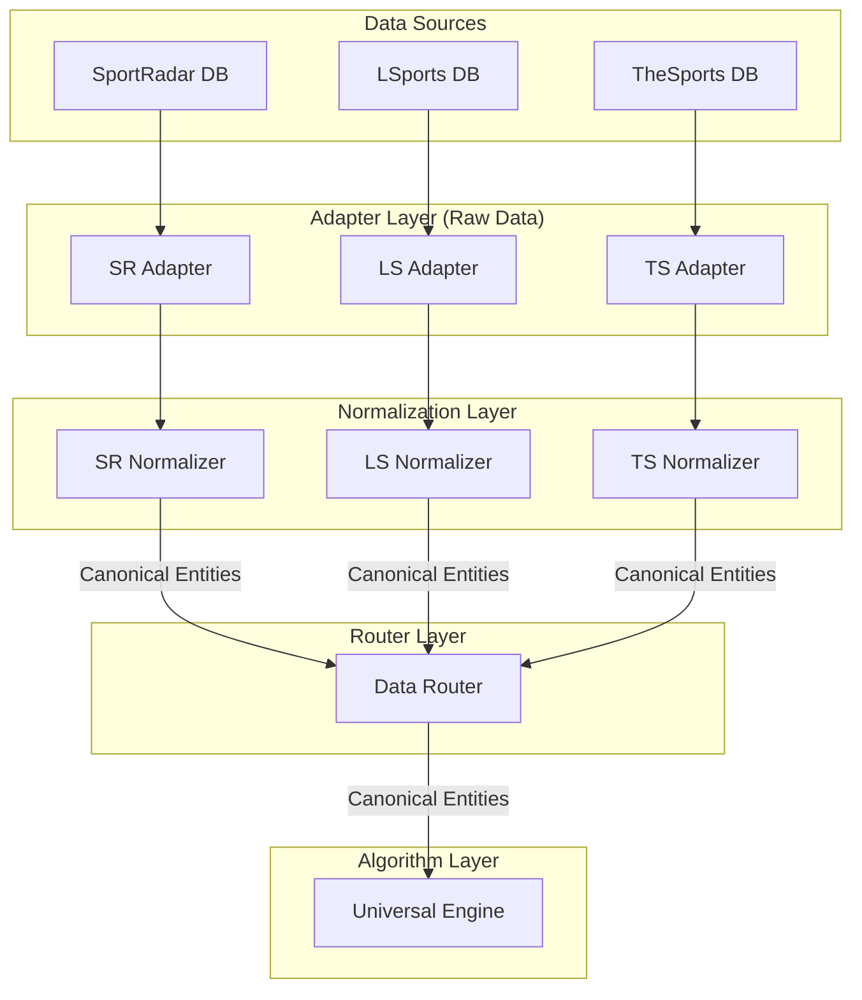

# 标准化数据路由与清洗层设计 (Router + Normalizer)

## 1. 背景与现状评估

当前 `sports-matcher-go` 仓库在算法泛化能力上已取得显著进展，特别是通过 `UniversalEngine` 和 `SourceAdapter` 接口，实现了 SR↔TS 和 LS↔TS 匹配链路的逻辑复用。然而，在数据获取与清洗层面，仍存在以下局限性：

1. **数据模型未完全统一**：`models.go` 中仍保留了 `SREvent`、`LSEvent` 等带有数据源前缀的结构体，尽管它们的字段高度平行。算法层（如 `MatchEvents`）实际上消费的是 `SREvent` 形状的数据，LS 链路在调用前需要进行显式转换。
2. **清洗逻辑分散**：时间格式解析（如 `parseISO8601Unix`、`parseLSScheduled`）、运动类型映射（如 `sportFromID`、`lsSportName`）等清洗逻辑散落在各个 `adapter` 实现中，缺乏统一的 `Normalizer` 层。
3. **外部接口未收敛**：`api/server.go` 中仍按数据源区分路由（`/api/v1/match/*` 和 `/api/v1/ls/match/*`），未能实现真正的单一入口。

为了彻底解耦数据源与匹配算法，需要设计并实现一层**标准化数据路由与清洗层（Router + Normalizer）**。

## 2. 架构设计

新的架构将引入 `Canonical`（规范化）实体模型，并在 Adapter 与 Engine 之间插入 `Normalizer` 和 `Router`。



## 3. 核心组件定义

### 3.1 规范化实体模型 (Canonical Models)

在 `internal/db/canonical_models.go` 中定义统一的数据结构，消除源前缀。

```go
package db

// CanonicalTournament 规范化联赛
type CanonicalTournament struct {
    ID           string
    Name         string
    Sport        string // 统一为 "football", "basketball" 等
    CategoryName string
    Source       string // "sr", "ls", "ts"
}

// CanonicalEvent 规范化比赛
type CanonicalEvent struct {
    ID           string
    TournamentID string
    StartUnix    int64  // 统一为 Unix 时间戳
    HomeID       string
    HomeName     string
    AwayID       string
    AwayName     string
    StatusCode   int
    Source       string
}

// CanonicalTeam 规范化球队
type CanonicalTeam struct {
    ID     string
    Name   string
    Source string
}

// CanonicalPlayer 规范化球员
type CanonicalPlayer struct {
    ID          string
    Name        string
    FullName    string
    Birthday    string // YYYY-MM-DD 或空
    Nationality string
    TeamID      string
    Source      string
}
```

### 3.2 Normalizer 接口与实现

定义 `DataNormalizer` 接口，负责将 Adapter 获取的原始数据转换为 `Canonical` 实体。

```go
package db

type DataNormalizer interface {
    NormalizeTournament(raw interface{}) (*CanonicalTournament, error)
    NormalizeEvents(raw interface{}) ([]CanonicalEvent, error)
    NormalizePlayers(raw interface{}) ([]CanonicalPlayer, error)
}
```

**示例：LS Normalizer 实现**

```go
type LSNormalizer struct{}

func (n *LSNormalizer) NormalizeEvents(raw []LSEvent) ([]CanonicalEvent, error) {
    var canonical []CanonicalEvent
    for _, ev := range raw {
        canonical = append(canonical, CanonicalEvent{
            ID:           ev.ID,
            TournamentID: ev.TournamentID,
            StartUnix:    parseLSScheduled(ev.StartTime), // 集中处理时间清洗
            HomeID:       ev.HomeID,
            HomeName:     ev.HomeName,
            AwayID:       ev.AwayID,
            AwayName:     ev.AwayName,
            StatusCode:   ev.StatusID,
            Source:       "ls",
        })
    }
    return canonical, nil
}
```

### 3.3 Data Router 路由层

`DataRouter` 根据请求中的 `source` 参数，动态路由到对应的 Adapter 和 Normalizer，向 `UniversalEngine` 提供统一的数据流。

```go
package matcher

import "github.com/gdszyy/sports-matcher/internal/db"

type DataRouter struct {
    adapters    map[string]db.SourceAdapter // 假设重构后的统一 Adapter 接口
    normalizers map[string]db.DataNormalizer
}

func NewDataRouter() *DataRouter {
    return &DataRouter{
        adapters:    make(map[string]db.SourceAdapter),
        normalizers: make(map[string]db.DataNormalizer),
    }
}

func (r *DataRouter) Register(source string, adapter db.SourceAdapter, normalizer db.DataNormalizer) {
    r.adapters[source] = adapter
    r.normalizers[source] = normalizer
}

func (r *DataRouter) GetEvents(source, tournamentID string) ([]db.CanonicalEvent, error) {
    adapter, ok := r.adapters[source]
    if !ok {
        return nil, fmt.Errorf("unsupported source: %s", source)
    }
    rawEvents, err := adapter.GetRawEvents(tournamentID)
    if err != nil {
        return nil, err
    }
    return r.normalizers[source].NormalizeEvents(rawEvents)
}
```

## 4. 改造步骤与 TODO

1. **定义 Canonical 模型**：新增 `internal/db/canonical_models.go`。
2. **实现 Normalizer**：为 SR、LS、TS 分别实现 `DataNormalizer`，将散落的清洗逻辑（如时间解析、运动类型映射）迁移至此。
3. **重构 UniversalEngine**：修改 `UniversalEngine` 及其 `SourceAdapter` 接口，使其直接消费 `Canonical` 实体，移除内部的 `SREvent` 转换逻辑。
4. **引入 DataRouter**：在 API 层和 Engine 之间引入 `DataRouter`。
5. **统一 API 入口**：修改 `internal/api/server.go`，合并 `/api/v1/match/*` 和 `/api/v1/ls/match/*`，通过请求参数 `source=sr|ls` 进行路由。

## 5. 预期收益

- **完全解耦**：算法层（`UniversalEngine`）不再感知任何特定数据源的结构（如 `SREvent`），真正实现泛化。
- **高可扩展性**：接入新数据源（如 BetRadar）只需实现对应的 Adapter 和 Normalizer 并注册到 Router，核心算法零修改。
- **清洗逻辑内聚**：所有数据清洗规则集中在 Normalizer 层，便于测试和维护。
