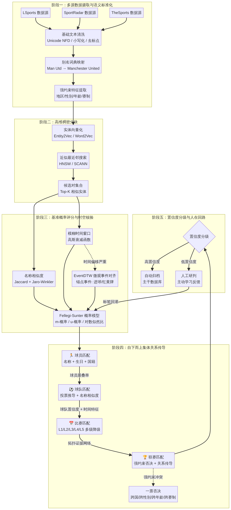

# 异构体育赛事数据通用匹配算法设计规划

**作者：Manus AI**
**日期：2026-04-16**

---

## 一、背景与问题诊断

### 1.1 业务场景

在 XP-BET 平台的体育赛事数据服务中，需要将来自 **LSports**、**SportRadar** 和 **TheSports** 三个异构数据源的联赛、比赛、球队和球员数据进行精准映射，为下游赔率系统提供统一的赛事标识。当前 `sports-matcher-go` 仓库实现了 SR↔TS 和 LS↔TS 两条匹配链路，但两条链路各自独立、逻辑分散，且在实际评估中暴露出严重的准确率问题。

### 1.2 现有算法的问题诊断

根据最新的联赛匹配评价报告 [1]，在排除低比赛数联赛（`event_count < 5`）后，当前算法在近两年非虚拟足球联赛样本上的准确率仅为 **44.44%**（18 个纳入统计的联赛中仅 8 个正确）。通过对现有代码和评估结果的深入分析，问题根源可以归纳为以下三个维度：

| 问题维度 | 具体表现 | 典型错误案例 | 现有代码缺陷 |
|---------|---------|------------|------------|
| **联赛名称泛化** | 高频泛化词（如 League、Cup、Championship）导致跨国、跨赛事体系的误吸附 | `The Championship (England)` → `ASEAN Championship`；`FA Cup (China)` → `FANS Cup` | `lsLeagueNameScore` 仅做 Jaccard + 国家加权，缺乏赛制/层级/性别等维度的强约束拦截 [2] |
| **比赛时间容差僵化** | 硬性时间分级（L1=5min, L2=6h, L3=24h, L4=72h）无法适应时区错误、赛程延期等复杂场景 | UTC vs 本地时区导致时差超过 24h 的比赛在 L3 阶段被遗漏 | `levelConfigs` 使用固定阈值，缺乏连续衰减的模糊评分机制 [3] |
| **球队/球员名称差异** | 跨语言音译、姓名顺序颠倒、缩写习惯不同导致名称匹配失败 | `Chelsea FC` vs `Chelsea`；`J. Doe` vs `Jonathan Doe` | `jaccardSimilarity` 基于 token 的 Jaccard 对短名称和缩写敏感度不足；LS 侧完全缺失球员层 [4] |

此外，LS↔TS 链路相比 SR↔TS 链路存在显著的功能缺口：LS 侧缺失球员匹配层和 `ApplyBottomUp` 自底向上校验，球队映射仅有投票法而未融合名称相似度，`KnownLSLeagueMap` 仅有 7 条且存在跨级别映射风险（如 `football:66` 德乙被映射到德甲） [5]。

### 1.3 设计目标

本规划的目标是设计一套**通用的匹配算法架构**，使其能够：

1. 统一 SR↔TS 和 LS↔TS 两条链路为一套通用引擎，消除代码重复和逻辑分散。
2. 将联赛匹配准确率从当前的 44.44% 提升至 **80%** 以上。
3. 有效应对联赛名称千奇百怪、比赛时间推迟或更迭、球队/球员名称差异这三大核心挑战。

---

## 二、核心设计理念：层次化集体实体解析

### 2.1 体育数据的拓扑结构

体育数据具有一个极其坚固且可预测的内在拓扑结构，即严格的**层次化嵌套特征** [6]。球员实体嵌套于球队实体之中，球队实体参与并嵌套于比赛实体之中，而比赛实体最终汇聚并嵌套于联赛实体之中。这种拓扑结构是通用算法的数学基础。

### 2.2 集体实体解析（CER）与置信度传导

传统的确定性匹配（要求所有字段精确匹配）和孤立的成对概率匹配（如 Fellegi-Sunter 模型）都忽略了实体之间的拓扑连通性 [6]。通用算法的核心范式是**集体实体解析（Collective Entity Resolution, CER）**，其核心思想是：在判断两个实体是否相同时，不仅比较它们自身的内部属性，还要比较它们各自关联的上下文实体。

> 在一个孤立的层级上（例如仅看联赛名称），两组数据可能看起来毫无关联；但是，如果能够通过概率模型在子层级（如球员）上实现高置信度的匹配，这种置信度就可以沿着数据的拓扑结构向上传导。即使单个实体的属性存在巨大差异，整个层次结构中所有实体恰好同时发生随机且不相关的变异在统计学上是几乎不可能的。 [6]

这种机制通过**关系型聚类算法**被形式化。两个引用聚类之间的总相似度定义为属性相似度（Attribute Similarity）和关系相似度（Relational Similarity）的加权组合 [6]：

$$S_{total}(C_i, C_j) = (1 - \alpha) \cdot S_{attr}(C_i, C_j) + \alpha \cdot S_{rel}(C_i, C_j)$$

其中 $\alpha$ 代表关系权重的超参数。当底层球员节点开始共享越来越多已被成功合并的实体时，球队的关系相似度得分将呈指数级飙升，引发链式反应（Propagation Effect）。

---

## 三、通用算法五阶段架构设计



### 阶段一：多源数据摄取与语义标准化

#### 3.1.1 统一实体模型

通用算法的第一步是定义跨数据源的统一实体模型。通过分析现有代码中的 `models.go` [7]，三个数据源在四个层级上的字段覆盖情况如下：

| 实体层级 | 字段 | LSports | SportRadar | TheSports | 通用模型 |
|---------|------|---------|-----------|-----------|---------|
| **联赛** | 名称 | `Name` | `Name` | `Name` | `LeagueName` |
| | 国家/地区 | `CategoryName` | `CategoryName` | `CountryName` | `Region` |
| | 运动类型 | `SportID` (6046=足球) | `SportID` (sr:sport:1) | `Sport` (football) | `SportType` |
| **比赛** | 开赛时间 | `StartTime` (ISO8601) | `StartTime` (ISO8601) | `MatchTime` (Unix) | `StartUnix` (统一为 Unix 秒) |
| | 主队 ID/名称 | `HomeID` / `HomeName` | `HomeID` / `HomeName` | `HomeID` / `HomeName` | `HomeTeamID` / `HomeTeamName` |
| | 客队 ID/名称 | `AwayID` / `AwayName` | `AwayID` / `AwayName` | `AwayID` / `AwayName` | `AwayTeamID` / `AwayTeamName` |
| | 场馆 | 缺失 | `VenueID` / `VenueName` | `VenueID` / `VenueName` | `VenueID`（可选） |
| **球队** | 名称 | 通过比赛推导 | `Name` | `Name` | `TeamName` |
| | 球员列表 | **缺失** | `PlayerIDs` (JSON) | 通过球员表关联 | `PlayerIDs` |
| **球员** | 名称 | **缺失** | `Name` / `FullName` | `Name` | `PlayerName` / `FullName` |
| | 生日 | **缺失** | `DateOfBirth` | `Birthday` | `DateOfBirth` |
| | 国籍 | **缺失** | `Nationality` | `Nationality` | `Nationality` |

#### 3.1.2 基础文本清洗

现有代码中的 `normalizeName` 函数 [4] 已实现了基础的文本清洗逻辑，包括 Unicode NFD 去变音符号、小写化、替换常见分隔符（`·`, `.`, `-`, `_`, `,`）为空格、合并多余空格。通用算法将在此基础上增加以下增强：

1. **球队名称深度归一化**：复用现有 `team_name_normalizer.go` [8] 中的 8 步归一化流程，包括俱乐部类型缩写移除（AFC/FC/SC/VfL 等）、赞助商冠名词剥离、语言别名映射（Milano→Milan, Praha→Prague）、数字前缀处理、Saint-连字符处理等。
2. **联赛名称结构化解析**：将联赛名称拆解为 `{国家} + {赛事体系} + {层级} + {性别} + {年龄段} + {区域分区} + {赛制类型}` 的结构化特征向量，而非仅作为一个整体字符串进行比较。

#### 3.1.3 强约束特征提取

根据联赛评价规则 [1] 和强约束关键词词典 [9]，系统必须从原始数据中提取以下六个维度的强约束特征，作为后续匹配的硬性阻断条件：

| 强约束维度 | 提取规则 | 关键词示例 | 阻断逻辑 |
|-----------|---------|----------|---------|
| **地区/国家** | 从 `CategoryName` / `CountryName` 提取，结合国家别名映射表 | `England`, `Poland`, `International` | LS 的国家与 TS 候选必须一致；洲际赛事不约束国家 |
| **性别** | 从联赛名称中检测性别关键词 | `Women`, `Female`, `Girls`, `Men`, `Male`, `Boys` | 男女赛事不得互相吸附 |
| **年龄段** | 从联赛名称中检测年龄层关键词 | `U23`, `U21`, `U19`, `Youth`, `Reserve` | 年龄层必须逐级一致 |
| **区域分区** | 从联赛名称中检测区域关键词 | `North`, `South`, `East`, `West`, `Central` | 分区联赛不得吸附到上级联赛 |
| **赛制类型** | 从联赛名称中检测赛制关键词 | `Cup`, `League`, `5x5`, `Futsal`, `Indoor`, `Amateur` | Cup 与 League 不得互吸；特殊赛制必须同类 |
| **层级** | 从联赛名称中检测层级数字 | `Liga 3`, `4 Liga`, `2.Bundesliga` | 层级数字不一致时否决 |

### 阶段二：候选集生成（分块策略）

#### 3.2.1 当前方案的瓶颈

现有代码在比赛匹配阶段（`MatchEvents`）对每个 SR/LS 比赛遍历全部 TS 比赛列表 [3]，时间复杂度为 $O(N \times M)$。在联赛匹配阶段（`matchLSLeague`）同样遍历全部 TS 联赛列表 [2]。当数据量扩展到覆盖更多运动类型和历史数据时，这种暴力搜索将成为性能瓶颈。

#### 3.2.2 分层分块策略

通用算法采用**分层分块（Hierarchical Blocking）**策略，在不同实体层级使用不同的分块键：

| 实体层级 | 分块键 | 分块逻辑 | 预期候选集缩减比 |
|---------|-------|---------|---------------|
| **联赛** | `SportType` + `Region` | 同运动类型 + 同国家/地区的联赛才进入候选对比较 | 约 95% |
| **比赛** | `LeagueID`（已匹配）+ 时间窗口 | 已匹配联赛内、时间窗口内的比赛才进入候选对比较 | 约 90% |
| **球队** | `LeagueID`（已匹配） | 同联赛内的球队才进入候选对比较 | 约 95% |
| **球员** | `TeamID`（已匹配）+ 姓名首字母 | 同球队内、姓名首字母相同的球员才进入候选对比较 | 约 80% |

对于未来数据量进一步增长的场景，可引入**稠密分块（Dense Blocking）**：将实体记录通过预训练的实体向量化模型转换为高维向量，部署 HNSW 或 SCANN 向量检索引擎执行近似最近邻搜索 [6]。

### 阶段三：基准概率评分与时空核验

#### 3.3.1 名称相似度计算（核心优化点）

名称相似度是匹配算法的基石。针对不同实体类型，通用算法采用差异化的相似度计算策略：

**球员名称相似度**：现有代码中的 `playerNameSimilarity` [4] 已实现了多候选组合策略（原始顺序、排序、去中间名、首尾 token、姓名反转），在所有候选组合上取最大 Jaccard。通用算法将在此基础上增加以下增强：

1. **Jaro-Winkler 相似度**：对于短名称（token 数 $\le 2$），Jaro-Winkler 比 Jaccard 更优越，因为它考虑了字符换位和前缀匹配 [6]。通用算法将 Jaccard 和 Jaro-Winkler 取最大值作为最终得分。
2. **生日消歧加权**：现有代码中生日一致时给予 0.15 的固定加成 [10]。通用算法将采用 Fellegi-Sunter 模型的 u-概率思想：如果两名球员共享一个极其罕见的生日（如 2 月 29 日），匹配证据权重应远高于共享一个常见生日（如 1 月 1 日）。
3. **国籍辅助验证**：当球员名称相似度处于边界区间（0.60-0.85）时，国籍一致性可作为辅助消歧特征。

**球队名称相似度**：现有代码中的 `teamNameSimilarity` [4] 取直接 Jaccard 和归一化后 Jaccard 的最大值，并通过 `TeamAliasIndex` [3] 实现动态别名学习。通用算法的优化方向包括：

1. **编辑距离融合**：对于仅存在轻微拼写差异的球队名（如 `Atletico` vs `Atlético`），Levenshtein 编辑距离比 Jaccard 更敏感。通用算法将 Jaccard、Jaro-Winkler 和归一化 Levenshtein 三者取加权最大值。
2. **全局别名知识图谱**：将 `TeamAliasIndex` 从单次运行的内存级索引升级为持久化的全局知识图谱，跨任务、跨联赛共享球队别名映射。每次成功匹配的球队对自动写入知识图谱，供后续任务直接查询。

**联赛名称相似度**：这是当前准确率最低的环节。通用算法将彻底重构联赛匹配逻辑：

1. **结构化特征向量比较**：不再将联赛名称作为整体字符串比较，而是将其拆解为结构化特征向量后逐维度比较。名称的核心语义部分（如 `Premier League`）使用 Jaccard 计算相似度，而强约束特征（地区、性别、年龄段等）使用精确匹配。
2. **强约束一票否决**：任何强约束维度的冲突（如跨国、跨性别、跨年龄段、跨赛制）将直接否决该候选，无论名称相似度多高。这将彻底解决 `BudnesLiga LFL 5x5` 误配到 `Bundesliga`、`UEFA European Championship U19 Women` 误配到 `UEFA European Championship` 等问题 [1]。
3. **层级数字精确校验**：从联赛名称中提取层级数字（如 `Liga 3` 中的 `3`、`4 Liga` 中的 `4`），层级数字不一致时直接否决。

#### 3.3.2 模糊时间窗口（核心优化点）

现有代码使用硬性时间分级（L1=5min, L2=6h, L3=24h, L4=72h），每个级别内部使用线性衰减 [3]。通用算法将升级为**基于高斯衰减的连续模糊时间窗口**：

$$S_{time}(\Delta t) = \exp\left(-\frac{\Delta t^2}{2\sigma^2}\right)$$

其中 $\Delta t$ 为两个时间戳的绝对差值（秒），$\sigma$ 为衰减参数。不同场景下的 $\sigma$ 取值建议如下：

| 场景 | $\sigma$ 取值 | 时间差 0 min 得分 | 时间差 2 h 得分 | 时间差 24 h 得分 | 时间差 72 h 得分 |
|-----|-------------|----------------|--------------|---------------|---------------|
| 标准匹配 | 3600 (1h) | 1.000 | 0.135 | ≈0 | ≈0 |
| 宽松匹配 | 10800 (3h) | 1.000 | 0.802 | 0.011 | ≈0 |
| 超宽容差 | 43200 (12h) | 1.000 | 0.980 | 0.607 | 0.011 |

这种连续衰减机制确保时间偏移不会成为否决正确匹配的单一致命因素，同时时间差越大，得分自然衰减，避免误匹配。

对于时间偏移极端严重的情况（如赛程延期导致时差超过 72 小时），系统可选择性地下钻至比赛事件流数据，应用 **EventDTW** 算法对齐红黄牌、进球等锚点事件的时间序列 [6]。若 DTW 路径成本极低，则直接覆盖开赛时间差异，输出高置信度的匹配结果。

#### 3.3.3 综合概率评分

通用算法采用 **Fellegi-Sunter 概率模型** [6] 的思想，将各维度的相似度得分转化为对数似然比并线性相加：

$$W_{total} = \sum_{k} \log\frac{P(f_k | \text{Match})}{P(f_k | \text{Non-Match})}$$

其中 $f_k$ 为第 $k$ 个特征的相似度状态。各特征的权重通过期望最大化（EM）算法在无标签数据上无监督学习 [6]。在工程实现的初期阶段，可使用手动设定的权重作为起点：

| 实体层级 | 特征 | 权重 | 说明 |
|---------|------|------|------|
| **比赛** | 时间相似度 | 0.25 | 高斯衰减得分 |
| | 主队名称相似度 | 0.30 | 别名增强后的综合得分 |
| | 客队名称相似度 | 0.30 | 别名增强后的综合得分 |
| | 底向上球队置信度加成 | 0.15 | 来自球员重叠率的传导 |
| **联赛** | 核心名称相似度 | 0.30 | 去除强约束特征后的语义核心 |
| | 地区一致性 | 0.25 | 精确匹配或别名映射 |
| | 比赛反向确认率 | 0.35 | 底层比赛匹配成功的比例 |
| | 强约束通过率 | 0.10 | 所有强约束维度均通过 |

### 阶段四：自下而上集体关系传导

这是通用算法的核心阶段，实现从球员到联赛的四层置信度传导。

#### 3.4.1 球员 → 球队传导

现有代码中的 `ApplyBottomUp` [10] 已实现了基础的球员重叠率校正机制：计算每个球队的球员匹配率，按 0.20/0.40/0.60 三档给予球队 0.03/0.08/0.15 的置信度加成。通用算法将优化为**连续函数**：

$$\text{Bonus}_{team} = \min\left(0.20, \quad 0.25 \times \text{PlayerOverlapRate}^{0.8}\right)$$

这种连续函数避免了硬性分档带来的阶梯效应，使球员重叠率的每一点提升都能平滑地反映到球队置信度中。

#### 3.4.2 球队 → 比赛传导

现有代码中的比赛匹配采用五级降级策略（L1/L2/L3/L4/L5 + L4b） [3]。通用算法将保留多级降级的工程框架，但在每一级内部引入球队置信度的动态加权：

$$S_{event} = w_{time} \cdot S_{time} + w_{name} \cdot S_{name} + w_{team} \cdot \text{Bonus}_{team}$$

其中 $\text{Bonus}_{team}$ 为主客队球队置信度加成的均值。这意味着即使球队名称相似度较低（如 `Chelsea FC` vs `Chelsea` 的 Jaccard 仅 0.50），只要球员重叠率极高（如 0.80），球队的置信度加成将显著提升比赛匹配的综合得分。

#### 3.4.3 比赛 → 联赛传导（核心创新）

这是通用算法相对于现有系统的**最大创新点**。现有系统的联赛匹配是"自顶向下"的：先匹配联赛，再在已匹配的联赛内匹配比赛。通用算法引入**比赛反向确认（Reverse Confirmation）**机制，实现"自底向上"的联赛验证：

1. **初步联赛候选生成**：使用结构化特征向量比较 + 强约束过滤，生成联赛候选对列表（允许低置信度候选通过）。
2. **比赛层交叉验证**：对每个联赛候选对，加载双方的比赛数据，执行比赛匹配。计算**比赛反向确认率**：

$$\text{ReverseConfirmRate} = \frac{\text{成功匹配的比赛数}}{\min(\text{源A比赛数}, \text{源B比赛数})}$$

3. **联赛置信度融合**：将名称相似度、地区一致性和比赛反向确认率加权融合为联赛的最终置信度。比赛反向确认率的权重设为 0.35，是所有特征中最高的，体现了"底层证据优先"的设计哲学。
4. **强约束最终否决**：即使比赛反向确认率较高，如果强约束维度存在冲突（如跨性别、跨年龄段），仍然一票否决。这是防止"偶然撞中"的最后防线。

#### 3.4.4 传导规则的概率软逻辑（PSL）表达

上述传导逻辑可以用概率软逻辑（PSL）的规则形式精确表达 [6]：

**规则 1：球员到球队的向上传导**（权重 0.85）
```
PlayerMatch(P1, P2) & PlaysFor(P1, T1) & PlaysFor(P2, T2) => TeamMatch(T1, T2)
```

**规则 2：球队结合时间到比赛的向上传导**（权重 0.95）
```
TeamMatch(T1A, T2A) & TeamMatch(T1B, T2B) & CompetesIn(T1A, T1B, M1) &
CompetesIn(T2A, T2B, M2) & TimeSimilar(M1, M2) => MatchMatch(M1, M2)
```

**规则 3：比赛到联赛的最终传导**（权重 0.99）
```
MatchMatch(M1, M2) & BelongsToLeague(M1, L1) & BelongsToLeague(M2, L2) =>
LeagueMatch(L1, L2)
```

**拒绝约束：强约束冲突否决**
```
LeagueMatch(L1, L2) & GenderConflict(L1, L2) => FALSE
LeagueMatch(L1, L2) & AgeGroupConflict(L1, L2) => FALSE
LeagueMatch(L1, L2) & RegionConflict(L1, L2) => FALSE
LeagueMatch(L1, L2) & CompetitionTypeConflict(L1, L2) => FALSE
```

### 阶段五：置信度分级评估与人在回路

算法的输出不是简单的"匹配/不匹配"二元结论，而是伴随着分辨率质量分数的梯度评估：

| 置信度区间 | 分级 | 处理策略 | 预期占比 |
|-----------|------|---------|---------|
| $\ge 0.90$ | **高置信度** | 自动归档至主干数据库，无需人工干预 | 60-70% |
| $0.70 - 0.90$ | **中置信度** | 自动归档，但标记为"待复核"，定期批量抽检 | 15-25% |
| $0.50 - 0.70$ | **低置信度** | 推送至可视化前端，由体育数据专家人工研判 | 5-10% |
| $< 0.50$ | **未匹配** | 不归档，进入"待匹配池"等待新数据或人工补充映射 | 10-15% |

专家的人工研判结果将作为标签数据回灌到系统中，用于：
1. 更新全局别名知识图谱。
2. 微调 Fellegi-Sunter 模型的 m-概率和 u-概率参数。
3. 补充 `KnownLeagueMap` 和 `KnownTeamMap` 中的已知映射。

---

## 四、工程实施路线图

基于上述架构设计，工程实施分为四个阶段，按优先级排序：

### P0 阶段：强约束拦截与联赛匹配优化（预计 2 周）

这是投入产出比最高的阶段，预期将联赛匹配准确率从 44.44% 提升至 **70%** 以上。

| 任务 | 具体内容 | 涉及文件 |
|------|---------|---------|
| 联赛名称结构化解析 | 实现联赛名称的结构化特征提取（地区、性别、年龄段、区域、赛制、层级） | 新增 `internal/matcher/league_features.go` |
| 强约束一票否决 | 将 `league_guard_keywords.json` 中的规则硬编码为匹配阻断条件 | 修改 `ls_engine.go` 和 `league.go` 中的 `matchLeague` 函数 |
| 层级数字校验 | 提取联赛名称中的层级数字，不一致时否决 | 修改 `lsLeagueNameScore` / `leagueNameScore` |
| 名称相似度升级 | 引入 Jaro-Winkler 相似度，与 Jaccard 取最大值 | 修改 `name.go` |

### P1 阶段：LS 球员层接入与自底向上传导（预计 3 周）

这是打通 LS↔TS 完整传导链条的关键阶段。

| 任务 | 具体内容 | 涉及文件 |
|------|---------|---------|
| LS 球员数据接入 | 通过 lsport-connector 的 Snapshot API 获取球员数据 | 新增 `internal/db/ls_player_adapter.go` |
| LS 球员匹配 | 复用 `MatchPlayersForTeam` 逻辑，适配 LS 数据结构 | 修改 `team_player.go` |
| LS 自底向上校验 | 为 LS 链路激活 `ApplyBottomUp` | 修改 `ls_engine.go` |
| 比赛反向确认 | 实现联赛级的比赛反向确认率计算 | 新增 `internal/matcher/reverse_confirm.go` |

### P2 阶段：时间容差优化与全局别名（预计 2 周）

| 任务 | 具体内容 | 涉及文件 |
|------|---------|---------|
| 高斯衰减时间窗口 | 将硬性时间分级替换为连续高斯衰减函数 | 修改 `event.go` 中的 `levelConfigs` |
| 全局别名持久化 | 将 `TeamAliasIndex` 升级为数据库持久化的全局知识图谱 | 新增 `internal/db/alias_store.go` |
| 通用引擎统一 | 将 SR↔TS 和 LS↔TS 两条链路统一为一套通用引擎 | 重构 `engine.go` 和 `ls_engine.go` |

### P3 阶段：高级特性与持续优化（预计 4 周）

| 任务 | 具体内容 | 涉及文件 |
|------|---------|---------|
| 稠密分块 | 引入 Entity2Vec + HNSW 向量检索 | 新增 `internal/matcher/dense_blocking.go` |
| EM 参数学习 | 实现 Fellegi-Sunter 模型的无监督参数估计 | 新增 `internal/matcher/fs_model.go` |
| 人在回路前端 | 开发可视化前端供专家人工研判 | 新增前端项目 |
| EventDTW 微观对齐 | 实现基于事件流的动态时间规整 | 新增 `internal/matcher/event_dtw.go` |

---

## 五、预期效果与评估指标

| 指标 | 当前值 | P0 阶段目标 | P1 阶段目标 | P2 阶段目标 |
|------|-------|-----------|-----------|-----------|
| 联赛匹配准确率（event_count $\ge$ 5） | 44.44% | $\ge$ 70% | $\ge$ 80% | $\ge$ 90% |
| 比赛匹配率（热门联赛） | ~85% | ~88% | ~93% | ~95% |
| 球队映射覆盖率 | ~80% | ~82% | ~90% | ~95% |
| 误匹配率（False Positive） | ~30% | $\le$ 15% | $\le$ 8% | $\le$ 3% |

---

## 六、结论

本规划提出了一套以"层次化集体实体解析"为核心的通用体育数据匹配算法架构。该架构的核心创新在于三个方面：第一，通过结构化特征提取和强约束一票否决机制，从根本上解决联赛名称泛化导致的误匹配问题；第二，通过高斯衰减的连续模糊时间窗口替代硬性时间分级，有效应对比赛时间推迟或更迭的挑战；第三，通过球员→球队→比赛→联赛的四层自下而上置信度传导，利用底层实体的概率对齐作为数学证据，逆向覆盖并纠正上层实体的局部数据腐败。

这种摒弃局部差异、信仰全局结构关联的层次化匹配哲学，将从根本上抹平不同体育数据供应商之间的数据壁垒，为 XP-BET 平台构建一个真正干净、统一且无缝链接的高维数据底座。

---

## 参考文献

[1]: Manus AI. (2026). 联赛匹配评价规则（排除低比赛数样本）. `sports-matcher-go/docs/league_match_evaluation_rule.md`.

[2]: `sports-matcher-go/internal/matcher/ls_engine.go` — LSports↔TheSports 匹配引擎，包含 `matchLSLeague` 和 `lsLeagueNameScore` 函数.

[3]: `sports-matcher-go/internal/matcher/event.go` — 比赛匹配引擎（五级降级 + 联赛级队伍别名学习），包含 `levelConfigs` 和 `TeamAliasIndex`.

[4]: `sports-matcher-go/internal/matcher/name.go` — 名称归一化与相似度计算，包含 `normalizeName`、`jaccardSimilarity`、`playerNameSimilarity`、`teamNameSimilarity`.

[5]: `sports-matcher-go/docs/ls_ts_matching_assessment.md` — LS→TS 方案完整性评估报告.

[6]: 佚名. (2026). 异构体育赛事数据源的层次化实体解析与时空对齐研究报告.

[7]: `sports-matcher-go/internal/db/models.go` — 统一数据模型定义（SR/TS/LS 三组结构）.

[8]: `sports-matcher-go/internal/matcher/team_name_normalizer.go` — 球队名辅助归一化层.

[9]: `sports-matcher-go/docs/league_guard_keywords.json` — 地区、性别、年龄、区域与赛制的强约束关键词词典.

[10]: `sports-matcher-go/internal/matcher/team_player.go` — 球队映射推导和球员匹配，包含 `ApplyBottomUp`.
